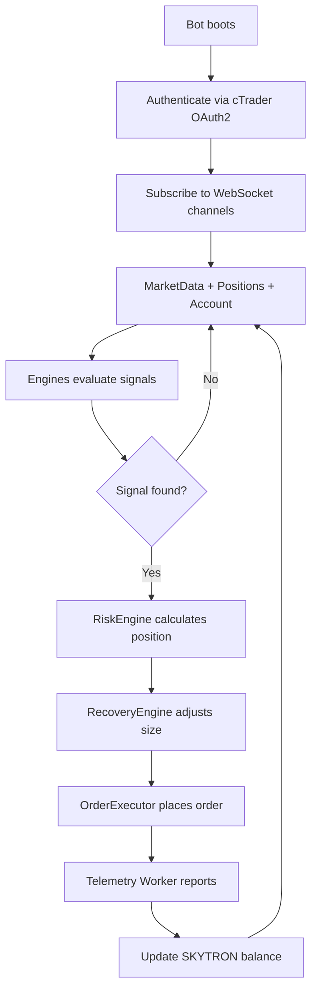

# 🚀 SkyBot Universe V2.0

**Cloud-native, modular trading bot ecosystem for algorithmic trading**

Each bot is an independent "ship" with interchangeable modules (engines) sharing a common conceptual language.

---

## 📘 Technical Master Document

**Version**: 2.0 (2025)
**Author**: Gadied A. Carrero — Pixels of Midnight Quant Research
**Scope**: Official technical architecture and operational guidelines for the SkyBot Universe trading ecosystem

---

## 🌟 Evolution: MT4 → cTrader Cloud-Native

SkyBot Universe has evolved from a Windows-dependent MT4 ecosystem into a **fully cloud-native, modular, scalable trading platform**.

### Migration Benefits

| Previous (MT4 / Windows) | Current (cTrader / Linux) |
|--------------------------|---------------------------|
| Requires Windows GUI | ✅ 100% headless Linux |
| Heavy, slow, resource-intensive | ✅ Ultra-light containers |
| Hard to scale | ✅ Infinite containers via Docker/K8s |
| No real-time telemetry | ✅ WebSocket live telemetry |
| Rigid EA architecture | ✅ Modular plug-and-play engines |
| High hosting cost | ✅ $5-12/month full infrastructure |
| Manual monitoring | ✅ Automated analytics dashboards |

---

## 🏗️ Architecture Overview

### Tech Stack

```
┌─────────────────────────────────────────────────────────┐
│                   SkyBot Universe V2.0                  │
├─────────────────────────────────────────────────────────┤
│ Platform:        Linux (headless) + Docker              │
│ Runtime:         .NET 8                                 │
│ Broker API:      cTrader Open API (REST + WebSocket)   │
│ Backend:         Node.js / Supabase                     │
│ Database:        PostgreSQL                             │
│ Orchestration:   Docker Swarm / Kubernetes              │
│ Telemetry:       WebSocket → Real-time dashboards       │
│ Economy:         SKYTRON (gamified currency)            │
└─────────────────────────────────────────────────────────┘
```

### Core Components

1. **Headless Bot Engine** (.NET 8 / Linux)
   - Runs as self-contained process
   - No GUI, no Windows dependency
   - 24/7 operation with auto-reconnect

2. **cTrader Open API Integration**
   - WebSocket: Market data stream (ticks, OHLC, positions)
   - REST: Order placement, position management
   - OAuth2: Secure authentication

3. **Modular Engine System**
   - SignalEngine: Entry/exit signals
   - RiskEngine: Position sizing, SL/TP, exposure control
   - RecoveryEngine: Smart recovery (controlled martingale)
   - HorizontalDetector: Range/consolidation detection

4. **Telemetry Worker**
   - Real-time profit tracking
   - Win/loss streaks
   - Operations per minute
   - Martingale levels
   - Live exposure monitoring

5. **SKYTRON Economy**
   - Gamified currency: 1 USD profit → 1 SKYTRON
   - Used for cosmetics, unlocks, ship upgrades
   - Never goes negative

---

## 🌌 Universe Conceptual Mapping

| Universe | Code Equivalent |
|----------|-----------------|
| 🚢 Ship | Bot (Atlas, Hydra, Raptor, Sentinel) |
| ⚙️ Module | Engine Class (SignalEngine, RiskEngine, etc) |
| 🔧 Slot | Configurable Parameters |
| 💥 Damage | Drawdown |
| ⚔️ Combat | Streaks (winning/losing) |
| ⛽ Fuel | Capital |
| 🏆 SKYTRON | Gamified currency (1 USD profit = 1 SKYTRON) |

---

## 📦 Project Architecture

```
SkyBot/
├── src/
│   ├── Core/                           # Shared reusable code
│   │   ├── SkyCore.Abstractions/      # Interfaces and contracts
│   │   ├── SkyCore.Common/            # Common utilities
│   │   └── SkyCore.Engines/           # Universe Engines
│   │       ├── SignalEngine           # 🔧 Motor - Generates signals
│   │       ├── RiskEngine             # 🛡️ Shield - Protects capital
│   │       ├── RecoveryEngine         # ⚡ Reactor - Handles streaks
│   │       └── HorizontalDetector     # 📡 Sensors - Detects ranges
│   │
│   └── Robots/                         # Specific bots (ships)
│       └── SkyCoreAtlas/              # First ship ✅
│           ├── SkyCoreAtlas.Core/     # Business logic
│           ├── SkyCoreAtlas.cBot/     # cTrader integration
│           └── SkyCoreAtlas.Tests/    # Unit tests
│
├── docs/                              # Documentation
│   └── architecture.md                # Detailed architecture
├── SkyBot.sln                         # Visual Studio Solution
└── README.md                          # This file
```

---

## 🎯 Key Features

### ✅ Total Modularity
- Each bot runs **without backend** (standalone)
- Shared reusable code between bots
- Easy to add new bots (Hydra, Raptor, Sentinel)

### ✅ Cloud-Native Architecture
- 100% headless Linux execution
- Docker containerization
- Horizontal scaling (Docker Swarm / Kubernetes)
- Ultra-low cost: **$5-12/month** for full infrastructure

### ✅ cTrader Open API Integration
- Real-time market data via WebSocket
- Order execution via REST API
- OAuth2 secure authentication
- No Windows/GUI dependency

### ✅ Advanced Risk Management
- Automatic drawdown control
- Simultaneous position limits
- Dynamic SL/TP calculation
- Recovery system for losing streaks

### ✅ Intelligent Recovery System
- Detects losing streaks
- Auto-reduces position sizes
- Modes: ReduceSize, Stop, Conservative

### ✅ Range Market Detection
- Identifies horizontal ranges
- Avoids trading in trendless markets
- Detects support/resistance levels

### ✅ Real-Time Telemetry
- Live profit tracking
- Win/loss streaks
- Operations per minute
- Martingale levels
- Exposure monitoring
- WebSocket streaming to dashboards

### ✅ SKYTRON Economy
- Gamified currency system
- 1 USD net profit → 1 SKYTRON
- Used for cosmetics, unlocks, upgrades
- Leaderboards (global + per-planet)

---

## 🚀 Quick Start

### 1. Compile the Project

```bash
# Clone or navigate to project
cd D:\Work\SkyBot

# Build
dotnet build SkyBot.sln

# Run tests
dotnet test
```

### 2. Deploy on Linux Server (Production)

**Recommended hosting**: Hetzner CX22 (runs 20-50 bots)

```bash
# Server structure
/bots/
   atlas/atlas.exe
   hydra/hydra.exe
   raptor/raptor.exe
/backend/api/
/telemetry-worker/
/postgres/
```

**Docker deployment**:
```bash
docker build -t skybot-atlas .
docker run -d --name atlas-001 \
  -e CTRADER_CLIENT_ID=xxx \
  -e CTRADER_SECRET=xxx \
  skybot-atlas
```

### 3. Deploy on cTrader (Development/Backtesting)

See detailed instructions at:
```
src/Robots/SkyCoreAtlas/SkyCoreAtlas.cBot/README_CTRADER.md
```

**Quick summary**:
1. Build in Release: `dotnet build -c Release`
2. Copy DLLs to cTrader
3. Create cBot in cTrader with example code
4. Configure parameters and run

---

## 🔧 Available Engines

### 1️⃣ SignalEngine (Motor)
- Generates entry/exit signals
- **Abstract base** - implement your own logic
- Override `AnalyzeEntry()` and `AnalyzeExit()`

### 2️⃣ RiskEngine (Shield)
- Calculates position size based on risk
- Manages drawdown limits
- Auto-calculates stop loss and take profit
- Controls simultaneous positions

### 3️⃣ RecoveryEngine (Reactor)
- Detects losing streaks
- Activates automatic recovery mode
- Dynamically adjusts position sizes
- Protects capital during bad runs

### 4️⃣ HorizontalDetector (Sensors)
- Detects ranging markets
- Identifies support and resistance
- Calculates range strength
- Avoids false signals in consolidation

---

## 📊 Automatic Metrics

The system automatically tracks:

| Metric | Description |
|--------|-------------|
| 💰 Capital | Current vs initial balance |
| 📉 Drawdown | Loss from peak |
| 🎯 Win Rate | % of winning trades |
| 📈 Profit Factor | Profit/loss ratio |
| ⚔️ Streaks | Consecutive wins/losses |
| 🔢 Total Trades | Operation counter |
| 🏆 SKYTRON | Gamified currency earned |

---

## 🛠️ Configuration

### SkyCoreAtlas Parameters

```csharp
var config = new AtlasConfiguration
{
    InitialCapital = 10000,           // Initial capital
    MaxRiskPerTrade = 0.02,           // 2% risk per trade
    MaxDailyDrawdown = 0.05,          // 5% max drawdown
    MaxPositions = 3,                 // Max simultaneous positions
    ATRMultiplier = 2.0,              // Multiplier for stop loss
    RiskRewardRatio = 2.0,            // Risk/reward ratio
    MaxConsecutiveLosses = 3,         // Streaks before recovery
    RecoveryMode = RecoveryMode.ReduceSize,  // Recovery mode
    RangeTolerance = 0.02,            // Range tolerance
    MinBarsInRange = 10,              // Min bars in range
    AvoidRangingMarkets = true        // Avoid sideways markets
};
```

---

## 🎮 Bot Execution Protocol

### Execution Flow



### Bot Composition

```csharp
var bot = new SkyCoreBot();
bot.RegisterEngine(new SignalEngine());
bot.RegisterEngine(new RiskEngine());
bot.RegisterEngine(new RecoveryEngine());
bot.RegisterEngine(new HorizontalDetector());
bot.Start();
```

---

## 🌐 Backend & Telemetry

### Backend Stack (Node.js / Supabase)

**Responsibilities**:
- Authentication and user accounts
- Linked broker accounts
- Leaderboards (global + per-planet)
- Bot session lifecycle
- Telemetry ingestion
- SKYTRON engine
- Marketplace (config distributions)

### Telemetry Route Example

```javascript
POST /telemetry/bot
{
  "botId": "atlas-482944",
  "profit": 12.5,
  "winRate": 91,
  "streak": 4,
  "skytron": 12.5,
  "timestamp": "2025-01-12T14:32:10Z"
}
```

### SKYTRON Calculation

```python
sessionProfit = sum(all trades profit)
if sessionProfit > 0:
    skytron = sessionProfit
else:
    skytron = 0
```

**Rule**: 1 USD net real profit → 1 SKYTRON

---

## 🧪 Testing

```bash
# Run all tests
dotnet test

# Run specific tests
dotnet test --filter "FullyQualifiedName~AtlasBotCore"

# With coverage
dotnet test /p:CollectCoverage=true
```

**Current status**: ✅ 17 tests passing

---

## 🔮 Roadmap 2.0

### ✅ PHASE 0 — Completed
- Architecture defined
- Modular engines
- Monorepo foundation

### 🔄 PHASE 1 — In Progress
- Production-ready SignalEngine for Atlas
- cTrader Open API integration (REST + WebSocket)

### 📋 PHASE 2
- Telemetry Worker + SKYTRON Engine
- Global Leaderboard + Planet Stats

### 📋 PHASE 3
- Visual Universe Platform (Next.js or Unity URP)
- Marketplace for bot configurations

### 📋 PHASE 4
- Additional ships (Hydra, Raptor, Sentinel)
- Advanced analytics dashboards

### 📋 PHASE 5
- Private Beta
- Community testing

---

## 🚢 Future Ships

### Planned Bots

- [ ] **SkyCoreHydra** - Multi-strategy bot
- [ ] **SkyCoreRaptor** - High-frequency bot
- [ ] **SkyCoreSentinel** - Defensive/conservative bot

### Adding a New Bot

```bash
# Copy Atlas structure
cp -r src/Robots/SkyCoreAtlas src/Robots/SkyCoreHydra

# Add to solution
dotnet sln add src/Robots/SkyCoreHydra/**/*.csproj

# Rename classes and namespaces
# Modify specific logic
# Reuse same engines
```

---

## 🐳 Docker Deployment

### Build Image

```dockerfile
FROM mcr.microsoft.com/dotnet/runtime:8.0
WORKDIR /app
COPY bin/Release/net8.0/ .
ENTRYPOINT ["dotnet", "SkyCoreAtlas.dll"]
```

### Run Container

```bash
docker build -t skybot-atlas .
docker run -d --name atlas-001 \
  -e CTRADER_CLIENT_ID=your_client_id \
  -e CTRADER_SECRET=your_secret \
  -e CTRADER_ACCOUNT_ID=your_account \
  --restart unless-stopped \
  skybot-atlas
```

### Docker Compose

```yaml
version: '3.8'
services:
  atlas-001:
    image: skybot-atlas
    environment:
      - CTRADER_CLIENT_ID=${CLIENT_ID}
      - CTRADER_SECRET=${SECRET}
    restart: unless-stopped

  telemetry-worker:
    image: skybot-telemetry
    depends_on:
      - postgres
    restart: unless-stopped

  postgres:
    image: postgres:15
    environment:
      - POSTGRES_DB=skybot
      - POSTGRES_PASSWORD=${DB_PASSWORD}
    volumes:
      - pgdata:/var/lib/postgresql/data
```

---

## 💰 Cost Analysis

### Hosting Costs (Monthly)

| Provider | Instance | Bots Capacity | Cost |
|----------|----------|---------------|------|
| Hetzner | CX22 | 20-50 bots | €5.83 (~$6) |
| Hetzner | CPX31 | 100+ bots | €11.00 (~$12) |
| DigitalOcean | Basic | 10-20 bots | $12 |

**Total infrastructure**: **$5-12/month** for professional-grade setup

---

## 📖 Documentation

- [Architecture Details](docs/architecture.md)
- [cTrader Integration Guide](src/Robots/SkyCoreAtlas/SkyCoreAtlas.cBot/README_CTRADER.md)
- [Quick Start Guide](QUICK_START.md)
- API Reference *(coming soon)*
- Examples *(coming soon)*

---

## ⚠️ Important Notices

- **This is a framework** - you must implement your own signal logic
- Always **backtest** before live trading
- Start with **demo account**
- Trading has **risk of capital loss**
- **No guarantee** of profitability
- SKYTRON is a **gamified currency**, not real money

---

## 🤝 Contributing

This is a personal project, but suggestions are welcome:

1. Fork the project
2. Create feature branch (`git checkout -b feature/AmazingFeature`)
3. Commit changes (`git commit -m 'Add AmazingFeature'`)
4. Push to branch (`git push origin feature/AmazingFeature`)
5. Open Pull Request

---

## 📝 License

Open source project. Use at your own risk.

---

## 🎯 Next Steps

1. ✅ **Compile**: `dotnet build`
2. 🔧 **Implement**: Create your custom SignalEngine
3. 🧪 **Backtest**: Test with historical data in cTrader
4. ⚙️ **Optimize**: Adjust risk parameters
5. 📊 **Paper Trade**: Test in demo account
6. 🚀 **Deploy**: Start with minimal capital

---

## 📞 Technical Specifications

**Version**: 2.0
**Platform**: Linux (headless) + Docker
**Runtime**: .NET 8
**Broker API**: cTrader Open API (REST + WebSocket)
**Backend**: Node.js / Supabase
**Database**: PostgreSQL
**Orchestration**: Docker Swarm / Kubernetes
**Telemetry**: WebSocket → Real-time dashboards
**Economy**: SKYTRON (1 USD profit = 1 SKYTRON)

---

**Welcome to the SkyBot Universe V2.0! 🚀**

*"Each bot is a ship. Each module, a component. Together, they form an algorithmic trading ecosystem."*

---

**Built with ❤️ by Pixels of Midnight Quant Research**
