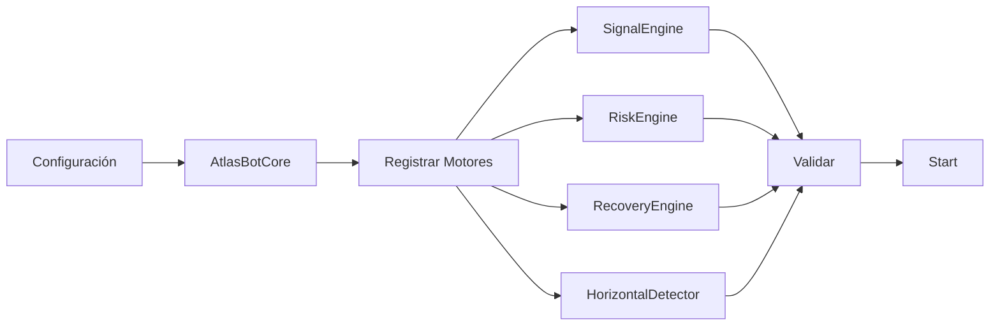
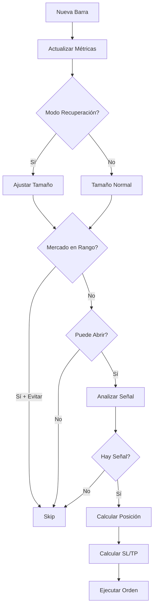
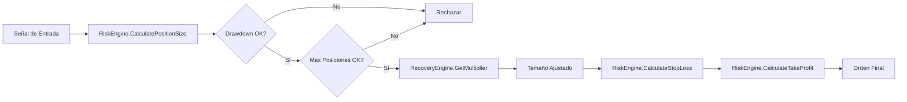

# 🏗️ Arquitectura de SkyBot Universe

## Principios de Diseño

### 1. Independencia de Bot (Bot-First Architecture)

Cada bot es una **entidad autónoma** que puede funcionar sin backend:

```
✅ Bot funciona localmente
✅ Bot funciona en cTrader standalone
✅ Bot puede migrar a otra plataforma
✅ Bot tiene su propia lógica completa
```

### 2. Lenguaje Conceptual Compartido

Todos los bots comparten las mismas abstracciones:

```csharp
IBotCore         // La "nave" principal
IEngine          // Los "módulos" instalables
EngineParameters // Los "slots" configurables
TradingMetrics   // El "estado" del combate
```

### 3. Composición sobre Herencia

Los bots se construyen **componiendo motores**, no heredando comportamiento:

```csharp
// ❌ MAL: Herencia rígida
class Atlas : TradingBot

// ✅ BIEN: Composición flexible
class Atlas : BaseBotCore
{
    private SignalEngine _signal;
    private RiskEngine _risk;
    private RecoveryEngine _recovery;
}
```

---

## Capas de Abstracción

### Layer 1: Abstractions (Contratos)

**Ubicación**: `src/Core/SkyCore.Abstractions/`

Define **QUÉ** debe hacer cada componente (no CÓMO):

- `IEngine`: Interfaz base de todos los motores
- `IBotCore`: Interfaz base de todos los bots
- `EngineParameters`: Sistema de configuración
- `TradingMetrics`: Métricas estándar

**Regla**: Esta capa **nunca** depende de otras capas.

### Layer 2: Common (Utilidades)

**Ubicación**: `src/Core/SkyCore.Common/`

Implementaciones **reutilizables** que todos los bots necesitan:

- `BaseBotCore`: Implementación base de `IBotCore`
- Helpers
- Extensions

**Dependencias**: Solo `SkyCore.Abstractions`

### Layer 3: Engines (Módulos)

**Ubicación**: `src/Core/SkyCore.Engines/`

Implementaciones **concretas** de motores reutilizables:

- `SignalEngine`: Base para señales (heredable)
- `RiskEngine`: Gestión de riesgo completa
- `RecoveryEngine`: Sistema de recuperación
- `HorizontalDetector`: Detección de rangos

**Dependencias**: `SkyCore.Abstractions`

### Layer 4: Bot Core (Lógica de Negocio)

**Ubicación**: `src/Robots/SkyCoreAtlas/SkyCoreAtlas.Core/`

Lógica **específica** del bot:

- `AtlasBotCore`: Implementación del bot Atlas
- `AtlasConfiguration`: Configuración específica
- Coordinación entre motores

**Dependencias**:
- `SkyCore.Abstractions`
- `SkyCore.Common`
- `SkyCore.Engines`

### Layer 5: Platform Integration (cBot)

**Ubicación**: `src/Robots/SkyCoreAtlas/SkyCoreAtlas.cBot/`

Adaptadores para **plataformas específicas**:

- Integración con cTrader API
- Mapeo de datos de mercado
- Ejecución de órdenes

**Dependencias**: `SkyCoreAtlas.Core` + APIs de la plataforma

---

## Flujo de Datos

### 1. Inicialización



### 2. Procesamiento de Barra (Ciclo Principal)



### 3. Gestión de Riesgo



---

## Patrones de Diseño Utilizados

### 1. Strategy Pattern (Motores)

Cada motor es una estrategia intercambiable:

```csharp
public interface IEngine
{
    void Initialize(EngineParameters parameters);
}

// Diferentes implementaciones
class SignalEngineA : SignalEngine { }
class SignalEngineB : SignalEngine { }
```

### 2. Template Method (BaseBotCore)

Define el esqueleto del algoritmo, las subclases completan los detalles:

```csharp
public abstract class BaseBotCore
{
    public virtual void Start()
    {
        ValidateEngines();
        OnStart(); // Override en subclase
    }

    protected virtual void OnStart() { }
}
```

### 3. Dependency Injection Manual

Los motores se inyectan en el constructor:

```csharp
public AtlasBotCore(AtlasConfiguration config)
{
    RegisterEngine(new SignalEngine());
    RegisterEngine(new RiskEngine());
}
```

### 4. Parameter Object (EngineParameters)

En lugar de muchos parámetros sueltos:

```csharp
// ❌ MAL
void Initialize(double a, double b, int c, string d)

// ✅ BIEN
void Initialize(EngineParameters parameters)
```

---

## Extensibilidad

### Agregar un Nuevo Motor

```csharp
// 1. Crear interfaz en SkyCore.Abstractions
public interface INewEngine : IEngine
{
    void DoSomething();
}

// 2. Implementar en SkyCore.Engines
public class NewEngine : INewEngine
{
    public string Name => "NewEngine";
    public string Version => "1.0.0";
    public bool IsEnabled { get; set; } = true;

    public void Initialize(EngineParameters parameters) { }
    public bool Validate() => true;
    public void DoSomething() { }
}

// 3. Registrar en el bot
public AtlasBotCore(AtlasConfiguration config)
{
    RegisterEngine(new NewEngine());
}
```

### Agregar un Nuevo Bot (Hydra, Raptor, etc.)

```bash
# 1. Crear estructura
mkdir -p src/Robots/SkyCoreHydra/{SkyCoreHydra.Core,SkyCoreHydra.cBot,SkyCoreHydra.Tests}

# 2. Crear proyectos
dotnet new classlib -n SkyCoreHydra.Core -o src/Robots/SkyCoreHydra/SkyCoreHydra.Core
dotnet new classlib -n SkyCoreHydra.cBot -o src/Robots/SkyCoreHydra/SkyCoreHydra.cBot
dotnet new xunit -n SkyCoreHydra.Tests -o src/Robots/SkyCoreHydra/SkyCoreHydra.Tests

# 3. Agregar a solución
dotnet sln add src/Robots/SkyCoreHydra/**/*.csproj

# 4. Agregar referencias
dotnet add src/Robots/SkyCoreHydra/SkyCoreHydra.Core reference src/Core/SkyCore.Abstractions
dotnet add src/Robots/SkyCoreHydra/SkyCoreHydra.Core reference src/Core/SkyCore.Common
dotnet add src/Robots/SkyCoreHydra/SkyCoreHydra.Core reference src/Core/SkyCore.Engines
```

```csharp
// 5. Implementar HydraBotCore.cs
public class HydraBotCore : BaseBotCore
{
    public override string BotName => "SkyCoreHydra";
    public override string Version => "1.0.0";

    // Tu lógica específica aquí
}
```

---

## Decisiones Arquitectónicas

### ¿Por qué .NET 8?
- ✅ Rendimiento nativo
- ✅ cTrader usa C#
- ✅ Multiplataforma (Windows, Linux, macOS)
- ✅ Ecosistema maduro

### ¿Por qué Class Libraries?
- ✅ Reutilizables entre proyectos
- ✅ Fácil testing
- ✅ Desacopladas de la plataforma
- ✅ Pueden convertirse a NuGet packages

### ¿Por qué separar Core y cBot?
- ✅ **Testear sin cTrader**: Unit tests puros
- ✅ **Migración fácil**: Cambiar a MT5, TradingView, etc.
- ✅ **Desarrollo offline**: No necesitas cTrader abierto
- ✅ **Reutilización**: Mismo core, diferentes frontends

### ¿Por qué no usar DI Container?
- ✅ Simplicidad: No es necesario para este caso
- ✅ Menos dependencias externas
- ✅ Más control explícito
- ⚠️ Futuro: Podría agregarse si crece la complejidad

---

## Anti-Patrones a Evitar

### ❌ 1. Acoplamiento con cTrader

```csharp
// ❌ MAL: Lógica acoplada a cTrader
public void ProcessBar(Bars bars, Indicators indicators)
{
    var atr = indicators.AverageTrueRange(14);
}

// ✅ BIEN: Datos agnósticos
public void ProcessBar(MarketData data)
{
    var atr = data.ATR;
}
```

### ❌ 2. Lógica en el cBot

```csharp
// ❌ MAL: Estrategia en el cBot
public class AtlasBot : Robot
{
    protected override void OnBar()
    {
        if (SMA20 > SMA50) // ❌ Lógica aquí
            ExecuteMarketOrder(...);
    }
}

// ✅ BIEN: Estrategia en Core
public class AtlasBot : Robot
{
    protected override void OnBar()
    {
        _botCore.ProcessBar(marketData); // ✅ Delegar
    }
}
```

### ❌ 3. Estado Global

```csharp
// ❌ MAL: Variables estáticas
public static class TradingState
{
    public static int OpenPositions;
}

// ✅ BIEN: Estado en instancia
public class AtlasBotCore
{
    private readonly TradingMetrics _metrics;
}
```

---

## Testing Strategy

### Unit Tests (Core)

```csharp
[Fact]
public void RiskEngine_CalculatesCorrectPositionSize()
{
    var engine = new RiskEngine();
    var params = new EngineParameters();
    params.Set("MaxRiskPerTrade", 0.02);
    engine.Initialize(params);

    var size = engine.CalculatePositionSize(10000, 50);
    Assert.Equal(4.0, size); // 10000 * 0.02 / 50
}
```

### Integration Tests (Bot + Engines)

```csharp
[Fact]
public void AtlasBot_ProcessesBarCorrectly()
{
    var config = new AtlasConfiguration();
    var bot = new AtlasBotCore(config);
    bot.Start();

    var data = new MarketData { /* ... */ };
    bot.ProcessBar(data);

    Assert.Equal(1, bot.Metrics.TotalTrades);
}
```

### Backtests (cTrader)

- Ejecutar en cTrader con datos históricos
- Validar métricas vs esperadas
- Comparar con benchmark

---

## Próximos Pasos

1. **Implementar SignalEngines concretos** (RSI, MACD, etc.)
2. **Agregar más bots** (Hydra, Raptor, Sentinel)
3. **Backend API** (REST/GraphQL)
4. **Frontend Dashboard** (React/Next.js)
5. **Base de datos** (PostgreSQL para métricas)
6. **Message Queue** (RabbitMQ para comunicación)

---

**Arquitectura diseñada para escalar de 1 bot a N bots sin reescrituras.**
